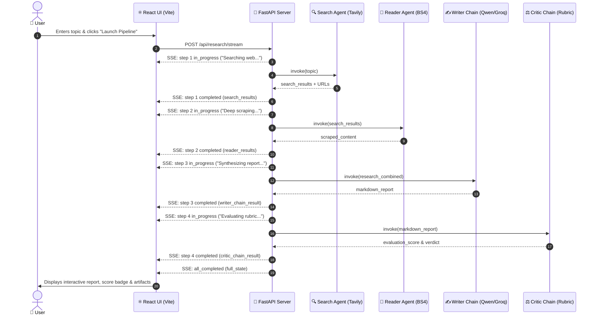
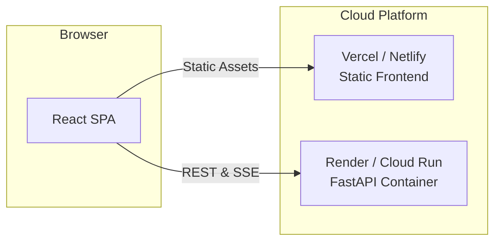

# 🌐 Deep Dive: Full-Stack Architecture (FastAPI + React)

This document explains the full-stack architecture, Server-Sent Events (SSE) streaming, frontend state management, and deployment strategies.

---

## 🏗️ Architecture Overview



---

## ⚡ Key Technical Concepts Explained

### 1. Server-Sent Events (SSE) vs WebSockets vs Long-Polling

| Protocol | Why We Chose SSE (`text/event-stream`) |
| :--- | :--- |
| **Server-Sent Events (SSE)** | **Ideal for AI Streaming**: Lightweight unidirectional streaming over standard HTTP. Built-in auto-reconnect, no custom socket protocol overhead, and works through standard reverse proxies. |
| **WebSockets** | Bi-directional protocol. Unnecessary overhead since the client only sends the topic once and receives incremental progress updates. |
| **Long-Polling** | High latency and wasteful HTTP handshake overhead. |

---

### 2. Thread Offloading (`asyncio.to_thread`)

LangChain / LangGraph synchronous `.invoke()` calls perform blocking network I/O. In `api.py`:
```python
search_results = await asyncio.to_thread(search_agent.invoke, {...})
```
- **Non-blocking Event Loop**: Offloads synchronous agent execution to a background worker thread, ensuring the FastAPI asynchronous event loop remains responsive and immediately pushes SSE events to the browser.

---

### 3. Frontend Architecture (`App.jsx` + `index.css`)

- **Live Stepper Visualizer**: Displays dynamic status badges (Pending, Active with rotating glow, Done with checkmark) for Steps 1 through 4.
- **Tabbed Artifact Inspector**: Lets users audit what each agent actually saw (Tavily search outputs, raw scraped HTML text, Critic rubric breakdown, and raw JSON blackboard state).
- **Markdown & Citation Rendering**: Uses `react-markdown` to format headers, bullet points, and hyperlinks for verified citations.
- **Export Capabilities**: One-click clipboard copy and PDF print styling.

---

## 🚀 Running the Full-Stack Application Locally

### Terminal 1: Start FastAPI Backend
```powershell
# In project root (C:\Multi Agent Ai)
.\.venv\Scripts\python.exe -m uvicorn api:app --reload --port 8000
```
- API will be live at: `http://127.0.0.1:8000`
- Interactive Swagger Docs: `http://127.0.0.1:8000/docs`

### Terminal 2: Start React Frontend
```powershell
cd frontend
npm run dev
```
- Web UI will be live at: `http://localhost:5173`

---

## 🌐 Production Deployment Guide



1. **Frontend (Vercel / Netlify / AWS S3 + CloudFront)**:
   - Build static assets: `npm run build`
   - Set environment variable `VITE_API_URL` pointing to the deployed backend.
2. **Backend (Render / Google Cloud Run / AWS ECS)**:
   - Package with Docker:
   ```dockerfile
   FROM python:3.11-slim
   WORKDIR /app
   COPY requirements.txt .
   RUN pip install --no-cache-dir -r requirements.txt
   COPY . .
   CMD ["uvicorn", "api:app", "--host", "0.0.0.0", "--port", "8000"]
   ```
   - Set `.env` environment variables (`GROQ_API_KEY`, `TAVILY_API_KEY`) in the cloud console.
