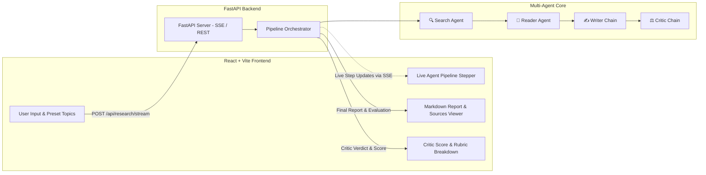

# Full-Stack Multi-Agent Research Platform (FastAPI + React)

Build a full-stack web application with a **FastAPI** backend and a **Vite + React** frontend that visualizes the 4-step autonomous multi-agent research pipeline in real-time.

---

## Architecture Overview

---

## User Review Required

> [!NOTE]
> - **Backend**: We will create `api.py` with FastAPI and Server-Sent Events (SSE) streaming so the frontend receives live step-by-step progress updates as each agent completes its task.
> - **Frontend**: We will create a `frontend/` directory using Vite + React with custom glassmorphism styling, dark mode, step animations, Markdown report rendering, and export options.
> - **Dependencies**: `fastapi`, `uvicorn`, and `sse-starlette` (or standard `StreamingResponse`) in the backend virtual environment, and standard React packages in `frontend/`.

---

## Proposed Changes

### Backend Component (`c:\Multi Agent Ai`)

#### [NEW] [api.py](file:///c:/Multi%20Agent%20Ai/api.py)
- FastAPI application with CORS enabled for frontend communication.
- Endpoints:
  - `GET /api/health`: Health check.
  - `POST /api/research/stream`: Server-Sent Events (SSE) endpoint that yields real-time updates as each step finishes:
    - Step 1: Search Agent active $\to$ search results with URLs.
    - Step 2: Reader Agent active $\to$ selected URL and scraped content.
    - Step 3: Writer Chain active $\to$ structured Markdown report.
    - Step 4: Critic Chain active $\to$ score, strengths, improvements, and verdict.
  - `POST /api/research`: Non-streaming fallback endpoint returning the complete `state` dictionary.

---

### Frontend Component (`c:\Multi Agent Ai\frontend`)

#### [NEW] Vite + React Application
- Scaffolded using `npx -y create-vite@latest frontend --template react`.
- Key Features & UI Components:
  1. **Header & Topic Bar**: Glowing search bar, sample prompt chips ("Agentic AI 2026", "Quantum Computing in 2026", "Multimodal LLMs"), and start button.
  2. **Pipeline Progress Stepper**: Interactive visual stepper showing the active status (Pending $\to$ In Progress $\to$ Completed) of:
     - 🔍 *Step 1: Autonomous Search Agent (Tavily)*
     - 📖 *Step 2: Deep Reader Agent (BeautifulSoup)*
     - ✍️ *Step 3: Synthesis Writer Chain (Qwen / Groq)*
     - ⚖️ *Step 4: Critic & Quality Gate (Rubric Scoring)*
  3. **Agent Live Inspect Drawer / Tabs**: Tabbed interface allowing users to inspect raw findings at any step (e.g. view raw search results, scraped article text).
  4. **Executive Report Viewer**: Formatted markdown display with sections, key findings, and clickable source links.
  5. **Critic Score & Evaluation Card**: Dedicated score badge ($X/10$), categorized Strengths, Areas for Improvement, and Verdict tag.
  6. **Export Tools**: One-click "Copy Markdown" and "Print / Save PDF" buttons.
  7. **Design System (`index.css`)**: Modern dark theme, glassmorphism cards, glowing accent borders (`#6366f1` / `#a855f7` / `#06b6d4`), smooth micro-transitions, and Inter / Outfit typography.

---

### Documentation Update

#### [MODIFY] [README.md](file:///c:/Multi%20Agent%20Ai/README.md)
- Add instructions on how to run both the FastAPI backend and React frontend.

#### [NEW] [docs/FULLSTACK_EXPLANATION.md](file:///c:/Multi%20Agent%20Ai/docs/FULLSTACK_EXPLANATION.md)
- Explains the full-stack architecture, FastAPI SSE streaming, and frontend state management for interviews.

---

## Verification Plan

### Automated & Backend Tests
- Start FastAPI server using `.\.venv\Scripts\python.exe -m uvicorn api:app --port 8000`.
- Send a test request to `/api/research/stream` using `curl` / `httpx` to verify streaming event generation.

### Frontend Validation & Browser Testing
- Run `npm install` and `npm run dev` in `frontend/`.
- Verify the web UI loads cleanly with zero console errors.
- Trigger a sample research topic from the UI and observe:
  1. Stepper animating through Steps 1 to 4 with status spinners/checks.
  2. Intermediate search and scraped data visible in the inspection tabs.
  3. Final research report rendering cleanly in markdown.
  4. Critic evaluation badge and rubric details rendering properly.
